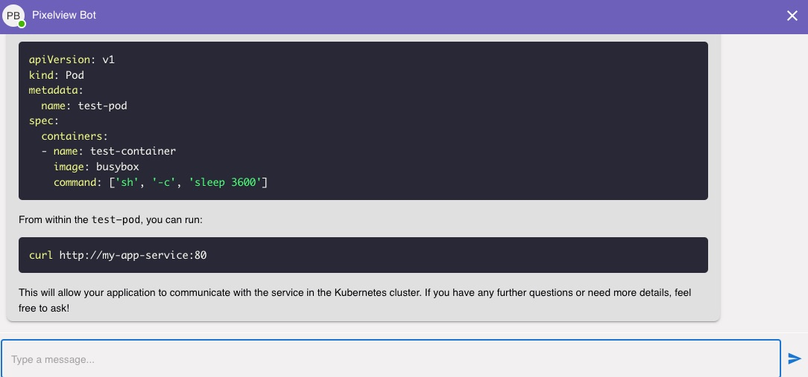

Managing complex multi-cloud environments like OpenStack, Kubernetes, and VMware requires constant vigilance, rapid response to alerts, and deep technical expertise. For Site Reliability Engineers (SREs) and DevOps teams, navigating sprawling dashboards, analyzing logs, and resolving incidents across multiple cloud platforms can be time-consuming and error-prone. PixelView, the all-in-one solution for multi-cloud management, workflows, and automation, introduces its AI-powered SRE Agent—a modular, extensible, and intelligent conversational tool designed to transform how teams interact with their cloud infrastructure.

<!-- more -->

## PixelView: The Ultimate Platform for Multi-Cloud Management

PixelView is a comprehensive software platform that unifies management, automation, and workflows for multi-cloud environments, including OpenStack, Kubernetes, and VMware. It provides real-time insights into instances, pods, and alerts, streamlines operations, and empowers teams to maintain system reliability across diverse cloud platforms with minimal effort. At the core of PixelView lies the SRE Agent, a sophisticated AI-driven assistant that leverages cutting-edge technology to simplify troubleshooting, fetch critical data, and deliver actionable solutions, all through a conversational interface.

## The PixelView SRE Agent: A Next-Generation Assistant

The PixelView SRE Agent is more than just a chatbot—it’s a technical support powerhouse designed for SREs and engineers managing multi-cloud infrastructure. Built on a modular, extensible platform, the SRE Agent integrates seamlessly with PixelView’s ecosystem, combining real-time data retrieval, Retrieval-Augmented Generation (RAG), and multi-agent AI capabilities to provide precise, context-aware responses. Whether you’re querying system health, analyzing alerts, or seeking solutions from a vast knowledge base, the SRE Agent is your tireless companion, available 24/7.

### Key Features of the PixelView SRE Agent

1. **Real-Time Conversational Insights**  
   Forget navigating complex dashboards or sifting through logs across multiple clouds. With the SRE Agent, you can ask questions like, “What’s the health of my Kubernetes cluster?” or “List my active OpenStack alerts.” Using a WebSocket-based chat server, the agent delivers real-time responses by fetching and analyzing data from PixelView’s multi-cloud management tools, OpenStack APIs, Kubernetes environments, and VMware systems. This conversational interface saves time and simplifies interaction with your infrastructure.

2. **Intelligent Alert Analysis and Resolution**  
   The SRE Agent excels at triaging and resolving alerts in dynamic multi-cloud environments. By invoking backend tools, it can retrieve alerts, inventory data, and system metrics, performing multi-step root cause analysis. For instance, if a pod is failing in Kubernetes or an instance is down in OpenStack, the agent can query the relevant APIs, cross-reference with alerts, and use RAG to search PixelView’s extensive documentation for tailored remediation steps. These solutions are delivered in clear, actionable language, reducing the mean time to resolution (MTTR).

3. **Retrieval-Augmented Generation (RAG) for Contextual Answers**  
   The SRE Agent leverages RAG to perform similarity searches across PixelView’s vast repository of OpenStack, Kubernetes, and VMware documentation. By generating embeddings for documents and storing them in MongoDB, the agent ensures that responses are not only accurate but also contextually relevant to your specific multi-cloud environment. Whether troubleshooting a misconfigured OpenStack instance, optimizing Kubernetes resource allocation, or resolving a VMware alert, the agent retrieves the most pertinent guidance, making it feel like you have an expert SRE by your side.

4. **Multi-Agent AI and Tool Integration**  
   The SRE Agent is built on a modular platform that routes queries to specialized AI agents (e.g., OpenAI or Ollama/Qwen) based on the question’s complexity or domain. It can call backend tools to interact with PixelView’s APIs for alerts and inventory, query OpenStack for instances and flavors, interact with Kubernetes for pod management, or access VMware for virtual machine data. This extensibility allows the agent to adapt to diverse use cases, from automated troubleshooting to knowledge base searches, all while maintaining a seamless user experience.

5. **Seamless Integration with PixelView’s Ecosystem**  
   Deeply embedded in the PixelView platform, the SRE Agent connects to your multi-cloud environments via APIs, pulling real-time data from observability tools, CI/CD pipelines, and logs across OpenStack, Kubernetes, and VMware. It supports both local and MongoDB Atlas deployments for storing chat history and embeddings, ensuring scalability and reliability. The agent can also automate routine tasks, such as scaling resources or clearing alerts, directly through conversational commands, streamlining workflows and reducing manual effort.

6. **Reducing Operational Toil**  
   Inspired by the mission to reduce engineer burnout, as seen in platforms like Resolve AI, the PixelView SRE Agent automates repetitive tasks and minimizes on-call stress. By handling alert triaging, root cause analysis, and solution recommendations across multiple clouds, it frees SREs to focus on strategic initiatives like system optimization and innovation. The agent’s ability to operate autonomously around the clock makes it an indispensable tool for modern DevOps teams.

## Why the PixelView SRE Agent Stands Out

Unlike traditional chatbots, the PixelView SRE Agent combines real-time data retrieval, RAG-powered knowledge search, and multi-agent AI to deliver a truly intelligent experience. Its ability to autonomously analyze alerts, fetch system data, and provide contextually relevant solutions across OpenStack, Kubernetes, and VMware sets it apart from static or rule-based systems. For example, when faced with a complex alert, the agent can:
- Retrieve alert details from PixelView’s API.
- Query OpenStack, Kubernetes, or VMware for related instance, pod, or virtual machine data.
- Perform a similarity search on documentation to recommend best practices.
- Present a clear, step-by-step resolution plan.

This level of automation and intelligence mirrors the expertise of a seasoned SRE, making the agent an invaluable asset for teams managing multi-cloud environments. Its natural language interface is intuitive, allowing engineers to interact effortlessly, regardless of their expertise level.

## The Bigger Picture: PixelView’s Vision

While the SRE Agent is a cornerstone of PixelView, it’s part of a broader mission to unify multi-cloud management, automation, and workflows in a single platform. PixelView eliminates the need for disparate tools by providing a centralized solution for managing OpenStack, Kubernetes, VMware, and other cloud platforms. By combining deep system insights with AI-driven automation, PixelView empowers teams to achieve greater reliability, reduce downtime, and accelerate development velocity.

PixelView’s SRE AI Agent tackles the operational complexities of multi-cloud environments. It reduces toil, enhances productivity, and enables SREs to focus on high-impact work, such as building resilient systems and driving innovation.

## Get Started with PixelView’s SRE Agent

Ready to revolutionize how you manage your multi-cloud environments? The PixelView SRE Agent is available as part of the PixelView platform, ready to integrate with your infrastructure in minutes. Simply deploy PixelView, connect it to your OpenStack, Kubernetes, and VMware environments, and let the SRE Agent start analyzing your systems, triaging alerts, and delivering intelligent solutions. With its RAG-powered documentation search, multi-agent AI, and seamless API integrations, the agent is your key to faster resolutions, reduced operational stress, and streamlined workflows.

Join the growing community of SREs and DevOps teams leveraging PixelView to simplify multi-cloud operations. Book a demo today and discover how the SRE Agent can transform your approach to multi-cloud management and troubleshooting, empowering your team to focus on what matters most—delivering value and driving innovation. Email: sulochan@gmail.com
