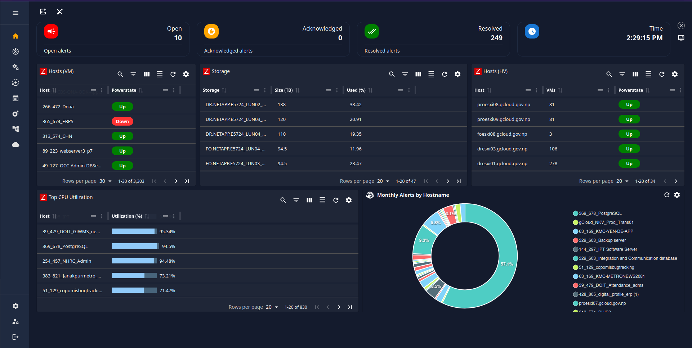
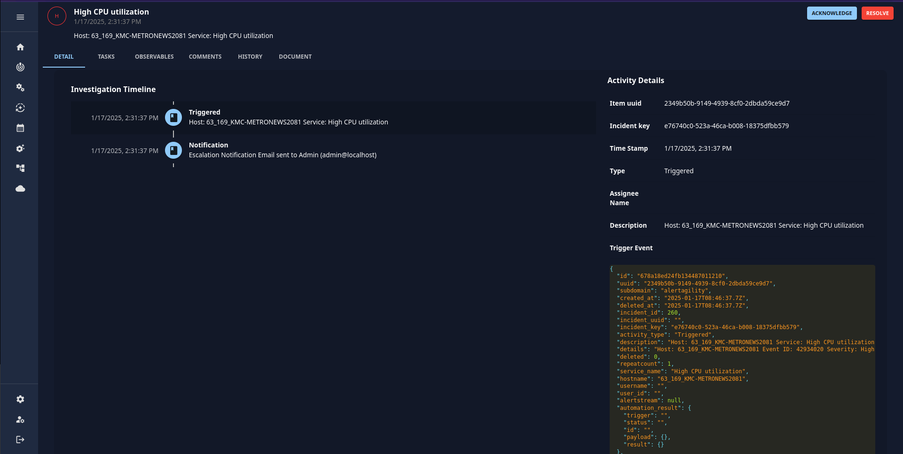
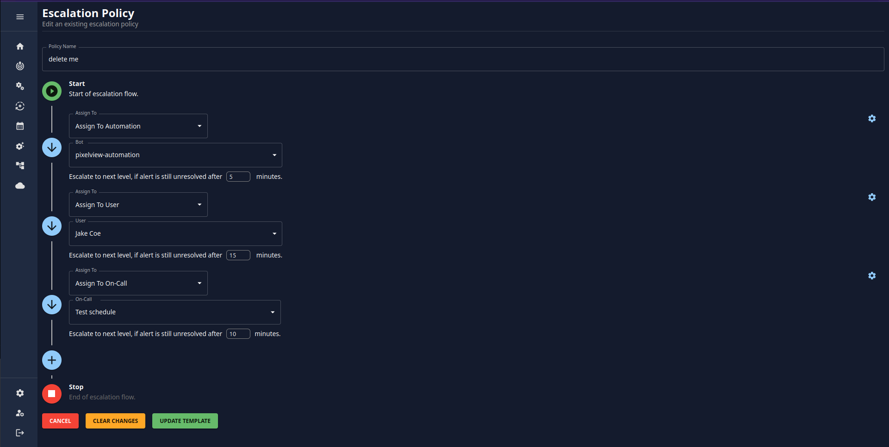
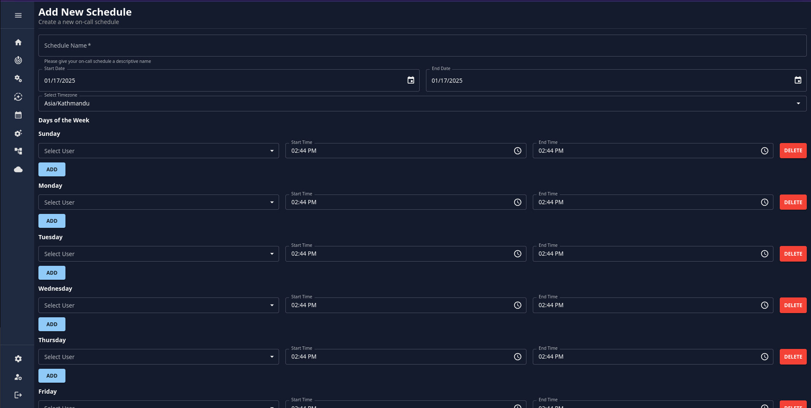

In the fast-evolving world of IT infrastructure, managing cloud environments can become overwhelming, especially when you have to monitor multiple systems and handle incidents across various platforms. Enter **Pixelview**, an all-in-one solution that simplifies incident management and monitoring. With support for popular monitoring tools like Zabbix, Prometheus, and Nagios, Pixelview integrates seamlessly into your existing workflows, making it a powerful ally for system administrators. Let’s explore why Pixelview is a great option for automation and how it’s transforming real-world operations.

<!-- more -->

---

### Streamline Your Cloud Infrastructure Monitoring

Pixelview enables you to manage your entire cloud infrastructure in one place. Whether you’re working with VMware Cloud or other platforms, this tool provides a highly customizable dashboard tailored to your specific needs. The ability to visualize all your metrics in one place eliminates the hassle of navigating complex systems or switching between multiple tools. With Pixelview, you get a clean, unified interface that saves you time and effort.

For instance, if you’re using Zabbix as your monitoring backend, you can simply connect your Zabbix URL to Pixelview. Within moments, your VMware Cloud infrastructure metrics—from resource usage to health statuses—are aggregated and displayed in an easy-to-read format. This setup not only saves hours of manual configuration but also enhances your ability to make informed decisions quickly.

The ability to consolidate multiple monitoring systems like Prometheus and Nagios into a single platform is another advantage. Instead of juggling between separate dashboards, you can view all critical metrics, track performance, and ensure seamless operations across your entire cloud ecosystem—all within Pixelview.
    

---

### Advanced Incident Management Made Easy

Pixelview’s incident management features are designed to simplify how organizations handle alerts and incidents. Its comprehensive **Cases** section ensures that every alert receives the attention it needs. Key functionalities include:

- **Adding Comments**: Collaborate effectively by adding notes and context to alerts. This helps teams understand the situation at a glance and coordinate their responses.
- **Task Assignment**: Assign specific tasks to individual users, teams, or on-call staff, ensuring accountability and clarity in handling incidents.
- **Alert History**: View the history of previous alerts for specific hosts or nodes, making it easier to identify recurring issues and their root causes.
- **Document Attachments**: Attach troubleshooting guides, logs, or other documents directly to the case, ensuring that all relevant information is available in one place.

Consider a scenario where a server in your VMware Cloud environment suddenly goes offline. Using Pixelview, you can immediately log the alert, assign it to the relevant team, and attach any supporting documentation to aid in resolving the issue. The alert history ensures that you can reference past incidents to identify patterns or similar problems, improving your ability to troubleshoot effectively.
    

---

### Escalation Policies That Work for You

One of Pixelview’s standout features is its powerful **escalation system**, which ensures that no alert goes unresolved. Escalation policies in Pixelview are highly customizable and can adapt to the unique requirements of your organization. Here’s how they work:

1. **Define Escalation Flows**: You can set up detailed workflows for handling alerts. For instance, when an alert is triggered, it can be assigned to a specific user, team, or on-call staff member for immediate action.
2. **Multiple Levels of Escalation**: If the assigned team doesn’t resolve the alert within a set timeframe, Pixelview automatically escalates it to the next level. Notifications are sent via email, text, or other channels to ensure prompt action.
3. **Customizable Notifications**: Pixelview ensures that stakeholders are kept in the loop at every stage. Whether it’s an initial alert or a resolution notification, the system supports multiple communication channels to keep everyone informed.
    

For example, imagine a database outage in a financial services company. The initial alert is sent to the database team. If they fail to resolve the issue within 15 minutes, Pixelview escalates the alert to a senior engineer or a dedicated crisis response team. The escalation flow ensures accountability while minimizing downtime and disruption.

---

### On-Call Scheduling for Enhanced Operational Efficiency

Pixelview takes team coordination to the next level with its **On-Call Schedule** feature. Managing on-call rotations can be challenging, but Pixelview simplifies this process by providing an intuitive interface for creating, editing, and managing schedules. Here’s what you can do with this feature:

1. **Create On-Call Schedules**: Define shifts and assign users or teams to specific time slots to ensure 24/7 coverage for critical systems.
2. **Edit or Delete Schedules**: Easily update existing schedules to accommodate changes in availability or team assignments.
3. **View Detailed On-Call Information**: Access comprehensive details about who is currently on call, their contact information, and their assigned responsibilities.
4. **Add Users to the Schedule**: Quickly add new users or teams to on-call rotations to maintain operational readiness.

This feature not only enhances coordination but also ensures accountability by clearly defining roles and responsibilities. For instance, during a major system outage, you can quickly identify and contact the on-call team responsible for addressing the issue, minimizing downtime and ensuring faster resolutions.

---

### Automate to Accelerate: The Power of Assign to Automation

Pixelview takes incident management to the next level with its **Assign to Automation** feature. This functionality enables alerts to be resolved automatically, without human intervention, by leveraging automation bots. When an alert is triggered, the system assigns it to a bot that runs predefined scripts or playbooks to address the issue.

#### Real-Life Example: Automation in Action

Let’s consider a situation where a node in your VMware Cloud environment experiences downtime. Here’s how Pixelview’s automation handles it:

1. The monitoring system detects the issue and sends an alert to Pixelview.
2. The alert is assigned to an automation bot configured to handle such scenarios.
3. The bot runs a script to restart the node or reallocate resources to maintain performance.
4. If the issue is resolved, the bot updates the alert status, and a resolution notification is sent to stakeholders.
5. If the issue persists, the alert is escalated to a human team for further investigation.

This level of automation significantly reduces response times and minimizes the need for manual intervention. It also ensures consistency in handling common issues, freeing up your IT staff to focus on strategic initiatives.

---

### Conclusion

Pixelview is more than just a monitoring tool; it’s a comprehensive solution that empowers organizations to manage their cloud infrastructure with ease and efficiency. By integrating with tools like Zabbix and Prometheus, it consolidates monitoring data, simplifies incident management, and introduces automation to reduce manual workloads.

For VMware Cloud environments, Pixelview’s capabilities shine even brighter. From customizable dashboards to powerful escalation flows, on-call scheduling, and automation bots, it provides everything you need to ensure uptime and reliability. Whether you’re a small business or a global enterprise, Pixelview is the tool you can trust to keep your infrastructure running smoothly while allowing your team to focus on innovation and growth.